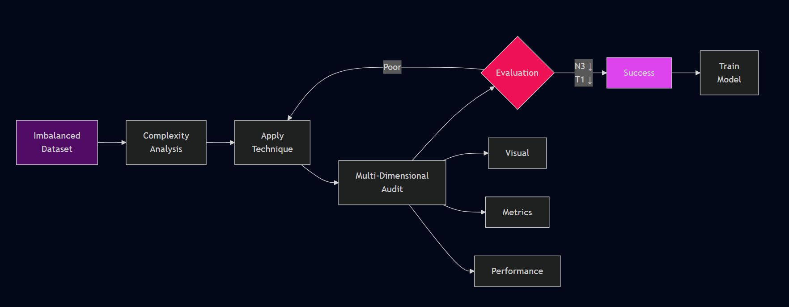

# FairSample

Fair sampling for imbalanced datasets with 14+ resampling techniques and 40+ complexity measures.

[](https://www.python.org/downloads/)
[](https://opensource.org/licenses/MIT)




## Why FairSample?

Most imbalanced learning packages only provide resampling techniques. FairSample adds **complexity measures** to help you understand *why* your dataset is difficult and *which* technique works best.

## Installation

```bash
pip install fairsample
```

## Quick Start

```python
from fairsample import RFCL
from fairsample.complexity import ComplexityMeasures
import pandas as pd

# Load data
df = pd.read_csv('data.csv')
X = df.drop('target', axis=1)
y = df['target']

# Check complexity
cm = ComplexityMeasures(X, y)
complexity = cm.analyze_overlap()
print(f"Overlap (N3): {complexity['N3']:.4f}")

# Apply resampling
sampler = RFCL(random_state=42)
X_resampled, y_resampled = sampler.fit_resample(X, y)

# Use resampled data
from sklearn.ensemble import RandomForestClassifier
clf = RandomForestClassifier()
clf.fit(X_resampled, y_resampled)
```

## Features

**14+ Resampling Techniques:**
- RFCL, NUS, URNS - Overlap-based undersampling
- SVDDWSMOTE, ODBOT, EHSO - Hybrid methods
- NBUS, KMeansUndersampling - Clustering-based (multiple variants)
- OSM - Comprehensive overlap handling
- RandomOverSampler, RandomUnderSampler - Baselines

**40+ Complexity Measures:**
- Feature Overlap: F1, F1v, F2, F3, F4, Input Noise
- Instance Overlap: N3, N4, kDN, CM, R-value, D3, SI, Borderline, Degree of Overlap
- Structural: N1, N2, T1, DBC, LSC, Clust, NSG, ICSV, ONB
- Multiresolution: Purity, Neighbourhood Separability, MRCA, C1, C2

## Usage

### Compare Multiple Techniques

```python
from fairsample.utils import compare_techniques

results = compare_techniques(
    X, y,
    techniques=['RFCL', 'NUS', 'URNS'],
    complexity_measures='basic'
)
print(results.sort_values('N3'))  # Lower N3 = less overlap
```

### Get All Complexity Measures

```python
# All measures
all_measures = cm.get_all_complexity_measures(measures='all')

# By category
feature_measures = cm.get_all_complexity_measures(measures='feature')

# Specific measures
selected = cm.get_all_complexity_measures(measures=['N3', 'F1', 'N1'])
```

### Compare Before/After

```python
from fairsample.complexity import compare_pre_post_overlap

X_resampled, y_resampled = sampler.fit_resample(X, y)
comparison = compare_pre_post_overlap(X, y, X_resampled, y_resampled)
print(comparison['improvements'])
```

## API

All techniques follow scikit-learn's API:

```python
sampler = RFCL(random_state=42)
X_resampled, y_resampled = sampler.fit_resample(X, y)
```

## Requirements

Python 3.8+ with numpy, scikit-learn, scipy, pandas, matplotlib, seaborn

## Contributing

Contributions welcome! See [CONTRIBUTING.md](CONTRIBUTING.md) for guidelines.

## Credits & References

FairSample implements techniques from the following research papers:

### Resampling Techniques

**RFCL (Repetitive Forward Class Learning)**
- Das, B., Krishnan, N. C., & Cook, D. J. (2014). RACOG and wRACOG: Two Probabilistic Oversampling Techniques. *IEEE Transactions on Knowledge and Data Engineering*, 27(1), 222-234.

**EHSO (Evolutionary Hybrid Sampling in Overlap)**
- Vuttipittayamongkol, P., & Elyan, E. (2020). Neighbourhood-based undersampling approach for handling imbalanced and overlapped data. *Information Sciences*, 509, 47-70.

**NBUS (Neighbourhood-Based Undersampling)**
- Vuttipittayamongkol, P., & Elyan, E. (2020). Neighbourhood-based undersampling approach for handling imbalanced and overlapped data. *Information Sciences*, 509, 47-70.

**NUS (Neighborhood Undersampling)**
- Yen, S. J., & Lee, Y. S. (2006). Under-sampling approaches for improving prediction of the minority class in an imbalanced dataset. *Lecture Notes in Computer Science*, 4093, 731-740.

**URNS (Undersampling by Removing Noisy Samples)**
- Gazzah, S., & Essoukri Ben Amara, N. (2008). New Oversampling Approaches Based on Polynomial Fitting for Imbalanced Data Sets. *Proceedings of the Eighth IAPR International Workshop on Document Analysis Systems*, 139-145.

**SVDD-Based Weighted SMOTE**
- Kang, Q., Chen, X., Li, S., & Zhou, M. (2017). A Noise-Filtered Under-Sampling Scheme for Imbalanced Classification. *IEEE Transactions on Cybernetics*, 47(12), 4263-4274.

**ODBOT (Overlap Distance-Based Oversampling Technique)**
- Prabhu, V., & Khare, A. (2021). ODBOT: Overlap Distance-Based Oversampling Technique for Imbalanced Datasets. *Neural Computing and Applications*, 33, 11099-11117.

**OSM (Overlap-based Sampling Method)**
- Santos, M. S., Soares, J. P., Abreu, P. H., Araujo, H., & Santos, J. (2018). Cross-Validation for Imbalanced Datasets: Avoiding Overoptimistic and Overfitting Approaches. *IEEE Computational Intelligence Magazine*, 13(4), 59-76.

**K-Means Undersampling**
- Yen, S. J., & Lee, Y. S. (2009). Cluster-based under-sampling approaches for imbalanced data distributions. *Expert Systems with Applications*, 36(3), 5718-5727.

### Theoretical Foundation

This package was developed based on research identifying gaps in overlap-handling evaluation:

- Santos, M. S., Abreu, P. H., Wilk, S., & Santos, J. (2023). On the joint-effect of class imbalance and overlap: a critical review. *Artificial Intelligence Review*, 56(11), 12753-12808.

*Full BibTeX citations available in [CITATIONS.md](CITATIONS.md)*

## License

MIT License - See [LICENSE](LICENSE) for details

## Citation

If you use FairSample in your research, please cite:

```bibtex
@software{fairsample,
  author = {Mohd Uwaish},
  title = {FairSample: Fair Sampling for Imbalanced Datasets},
  year = {2024},
  url = {https://github.com/mohdUwaish59/fairsample},
  version = {1.0.0}
}
```

**Important**: This package implements techniques from various research papers. Please see [CITATIONS.md](CITATIONS.md) for full citations and give proper credit to the original authors of each technique you use.
